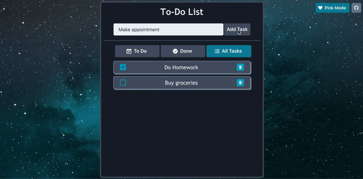

# react-to-do-list
A to-do list application made using Reactjs, Redux, and Chakra UI.

# Features
* The ability to sort tasks into three categories: to do, done, and all tasks.
* Responsive design that makes it fully functional on mobile devices.
* A dark mode and a pink mode (light mode).

# Demo
**Live demo here:** briannamcdonald.me/react-to-do-list/

# Usage
To run the project locally in development mode:
* Clone the repo with `git clone https://github.com/briannamcdonald/react-to-do-list.git`
* `cd react-to-do-list`
* Run `npm install` to install dependencies
* Run `npm start`
* Open `localhost:3000` in your browser
